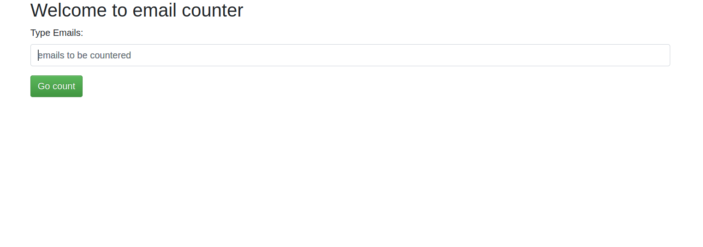
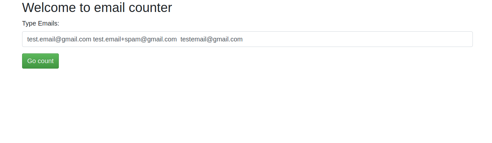
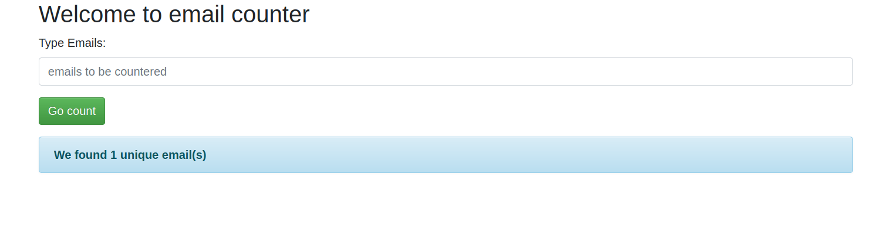

# Develop a web service for counting the number of unique emails

I use python **Flask** to implement light web service. Backend implementation is straightforward, so I simply gather code into app.py file. Each time we have a request, we run is_pyramid function to test the input string and return the corresponding bool value. Notice that **no database** is involved for this service.

We can set up virtual environment for this application through **virtualenv**, but I did not do it for simplicity.

## How does it work?
  1. pip install -r requirements.txt
  2. python app.py
  3. Open web browser to http://localhost:5000/
  4. Type in a list of emails(separated by space) in the box and click Go count button
  5. The result will show up

## Email format requirements:
  1. One and only one "@" must exist for each email
  2. no requirement for characters after "@"
  3. character must appear both before and after '@'
  4. no space is not allowed in email

## snapshot of test case: 'test.email@gmail.com test.email+spam@gmail.com testemail@gmail.com':

